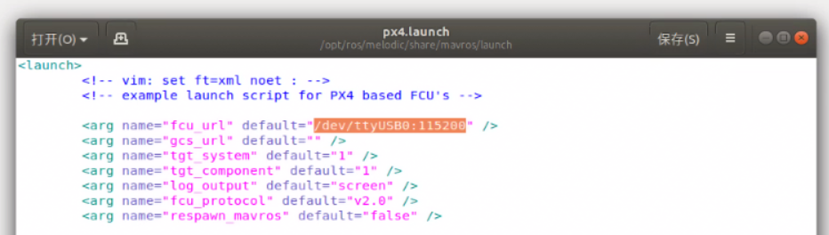
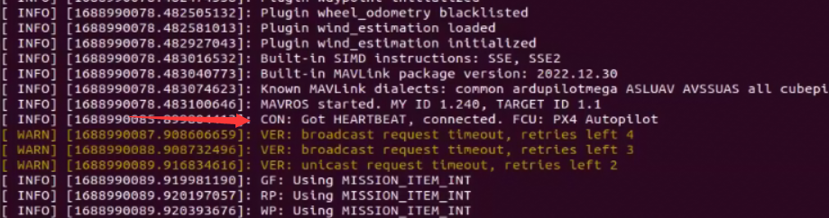
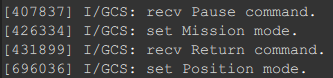

# 项目介绍


# 基本配置

## NUC

### Ubuntu 18.04.6 LTS

[下载](https://releases.ubuntu.com/18.04.6/ubuntu-18.04.6-desktop-amd64.iso)|安装

### ROS Melodic

[安装](https://blog.csdn.net/jianlai_/article/details/123545130)

### Mavros

```bash
$ sudo apt install ros-melodic-mavros ros-melodic-mavros-extras		# for ros-melodic
$ wget https://raw.githubusercontent.com/mavlink/mavros/master/mavros/scripts/install_geographiclib_datasets.sh
$ sudo chmod a+x ./install_geographiclib_datasets.sh
$ sudo ./install_geographiclib_datasets.sh		#这步需要装一段时间,请耐心等待PX4配置
```

### Realsense D435驱动

[realsense-ros/README.md at ros1-legacy · IntelRealSense/realsense-ros (github.com)](https://github.com/IntelRealSense/realsense-ros/blob/ros1-legacy/README.md#installation-instructions)

```bash
$ sudo apt-get install ros-$ROS_DISTRO-realsense2-camera
```


### Anaconda

[下载](https://mirrors.tuna.tsinghua.edu.cn/help/anaconda/)|[安装](https://blog.csdn.net/KIK9973/article/details/118772450)

```bash
$ wget https://mirrors.tuna.tsinghua.edu.cn/anaconda/archive/Anaconda3-2023.03-1-Linux-aarch64.sh
$ sudo chmod a+x ./Anaconda3-2023.03-1-Linux-aarch64.sh
```

创建虚拟环境

```bash
$ conda create -n uav python=3.8
```

**----------该节以下内容可跳过----------**

解决ROS Melodic不支持Python3问题：[ROS Melodic 上部署python3 环境 - 知乎 (zhihu.com)](https://zhuanlan.zhihu.com/p/626511511)

某些奇怪问题的解决：[(61条消息) ROS编译PyKDL python3_RuiH.AI的博客-CSDN博客](https://blog.csdn.net/qq_41035283/article/details/125714646)

```bash
sudo apt update
sudo apt install python3-catkin-pkg-modules python3-rospkg-modules python3-empy
mkdir -p ~/catkin_ws/src; cd ~/catkin_ws
catkin_make
source devel/setup.bash
wstool init
wstool set -y src/geometry2 --git https://github.com/ros/geometry2 -v 0.6.5
wstool up
rosdep install --from-paths src --ignore-src -y -r
catkin_make --cmake-args -DCMAKE_BUILD_TYPE=Release             -DPYTHON_EXECUTABLE=/home/tian/anaconda3/envs/uav/bin/python3.8  -DPYTHON_INCLUDE_DIR=/home/tian/anaconda3/envs/uav/include/python3.8             -DPYTHON_LIBRARY=/home/tian/anaconda3/envs/uav/lib/libpython3.8.so -DPYTHON_LIBRARY=/home/tian/anaconda3/envs/uav/lib/libpython3.8.so
```

cmake指令

```bash
cmake .. -DCMAKE_BUILD_TYPE=Release             -DPYTHON_EXECUTABLE=/home/tian/anaconda3/envs/uav/bin/python3.8  -DPYTHON_INCLUDE_DIR=/home/tian/anaconda3/envs/uav/include/python3.8             -DPYTHON_LIBRARY=/home/tian/anaconda3/envs/uav/lib/libpython3.8.so -DPYTHON_LIBRARY=/home/tian/anaconda3/envs/uav/lib/libpython3.8.so -DCMAKE_INSTALL_RPATH=/home/tian/anaconda3/envs/uav/lib/PyDKL.so -DCMAKE_INSTALL_PREFIX=/home/tian/anaconda3/envs/uav
```


### rs_yolo_ws

```bash
1. Environment
conda activate uav
cd rs_yolo_ws/src/rs_yolo/scripts
pip install  -U  -r   requirements.txt
pip install pyrealsense2
pip install rospkg

2.catkin_make
cd rs_yolo_ws
catkin_make

3.run
roscore
# new terminal
conda activate uav
source devel/setup.bash
rosrun rs_yolo rstest.py
```

订阅消息

```bash
cd rs_yolo_ws
source devel/setup.bash
rostopic echo /detect_result_out
```

### Gazebo（暂未配置）

[(69条消息) 通过ROS开启Gazebo的世界（这篇写得不错，教会了我怎么自己建一个gazebo的功能包，建立世界模型，导入机器人模型，通过roslaunch启动，值得细读真正学会！）_gazebo世界_TYINY的博客-CSDN博客](https://blog.csdn.net/sinat_16643223/article/details/115221367)

Gazebo是一个不错的仿真工具，它使用物理引擎模拟真实的世界，使得我们可以通过仿真的方式从原理上验证算法，计算负载和受力情况，进而指引我们做结构和算法的设计。 ROS则是一个方便的系统集成工具，可以轻松的监听传感器的数据，发布执行器的控制指令。如果将两者结合在一起，就可以自如的在真实世界和仿真世界之间来回切换。

为了达到自如切换的效果，我们需要研究一下如何在ROS系统中控制Gazebo以及其仿真的机器人模型。这主要涉及到三个方便的要素:(1) Gazebo的运行与world文件的加载 (2) 合理地处理URDF和SDF文件描述的机器人模型 (3) ROS与Gazebo之间的交互接口。本文关注第一个要素，通过rosrun或者roslaunch运行Gazebo。

官方提供了一系列的ROS包称为[gazebo_ros_pkgs](http://wiki.ros.org/gazebo_ros_pkgs)，提供了用ROS的消息、服务以及动态配置参数的机制在Gazebo环境中模拟一个机器人的接口。

### 测试心跳包（FMT）

```bash
# 串口查看
$ ls -l /dev/
```


```bash
# 如串口名为 /dev/ttyUSB0
# 授予串口权限
$ chmod 777 /dev/ttyUSB0
```


```bash
# 按照串口号和设置的波特率修改通信文件配置
$ cd /opt/ros/melodic/share/mavros/launch
$ sudo gedit px4.launch
```



```bash
# 新建终端 启动通信文件
$ roslaunch mavros px4.launch
```



若出现箭头指示字样，则说明NUC已接收到飞控传来的心跳包。

### 机载电脑控制无人机（FMT）

#### 模式设置

新建终端运行如下指令即可设置模式Mode，发送指令Command的方式和设置模式类似。

```bash
# 设置Position
rosservice call /mavros/set_mode "base_mode: 0
custom_mode: 'POSCTL'"

# 设置Mission
rosservice call /mavros/set_mode "base_mode: 0
custom_mode: 'AUTO.MISSION'"

# 设置Offboard
rosservice call /mavros/set_mode "base_mode: 0
custom_mode: 'OFFBOARD'"
```

运行成功后可见终端显示：`mode_sent: True`，则模式设置的命令发送成功。

可以在QGC的Mavllink控制台查看否接受到命令，成功接受命令如图：



FMT中的模式和指令设置和PX4类似，有些PX4模式和指令FMT不支持，具体见下表。

|    Modes     |  描述  | 无GPS连接 |                         备注                          |
| :----------: | :----: | :-------: | :---------------------------------------------------: |
| AUTO.MISSION |  任务  |  不可用   |                                                       |
|  RATTITUDE   | 半自稳 |     /     | 可成功发送但不能切换至此模式，可能是FMT中未设置该模式 |
|  STABILIZED  |  自稳  |   可用    |                                                       |
|   OFFBOARD   |  板外  |  不可用   |                                                       |
|    POSCTL    |  定点  |  不可用   |                                                       |
|    ALTCTL    |  定高  |   可用    |                                                       |
|     ACRO     |  特技  |   可用    |                                                       |
|    MANUAL    |  手动  |   可用    |                                                       |


|      Commands      | 描述 | 无GPS连接 | FMT是否支持 |
| :----------------: | :--: | :-------: | :---------: |
|   AUTO.PRECLAND    |  /   |           |   不支持    |
| AUTO.FOLLOW_TARGET |  /   |           |   不支持    |
|     AUTO.RTGS      |  /   |           |   不支持    |
|     AUTO.LAND      | 降落 |           |    支持     |
|      AUTO.RTL      | 返航 |  不可用   |    支持     |
|    AUTO.MISSION    | 任务 |  不可用   |    支持     |
|    AUTO.LOITER     | 保持 |           |    支持     |
|    AUTO.TAKEOFF    | 起飞 |           |    支持     |
|     AUTO.READY     |  /   |           |   不支持    |

Tip：无GPS连接不可用指可以使用机载电脑发送命令设置模式，飞控端也可以收到命令，但是无法成功切换模式，因为GPS未连接时这些模式受保护，不能切换。

#### 发送位置控制指令


```bash
# 发送位置控制指令，Offboard模式下有效。若进入Offboard模式后无控制信号指令发给飞控，即auto_cmd的消息的发布频率为0，飞机将进入Hold悬停状态。

rostopic pub /mavros/setpoint_raw/local mavros_msgs/PositionTarget "
header:
	seq: 0
	stamp:
		secs: 0
		nsecs: 0
	frame_id: ''
coordinate_frame: 1
type_mask: 2560
position:
	x: 100.0
	y: 50.0
	z: 10.0
velocity:
	x: 0.0
	y: 0.0
	z: 0.0
acceleration_or_force:
	x: 0.0
	y: 0.0
	z: 0.0
yaw: 0
yaw_rate: 0.0" -r 10
```

注意ROS的坐标系跟飞控的坐标系不一样，mavros会进行转换当发送这条消息后，飞控端会收到auto_cmd的消息，可以在飞控端输入`mcn echo auto_cmd`来打印输出：

## CUAV V5+

### 接线

[快速布线](https://doc.cuav.net/flight-controller/v5-autopilot/zh-hans/quick-start/quick-start-v5+.html)

### 数传连接

> 3DR Radio Telemetry配对步骤
>
> 1. 给数传模块供电，绿灯闪烁。
>
> 2. 按住配对按钮3秒，红灯快闪，进入配对模式。配对模式持续时间10秒。
>
> 3. 在10秒内给另一个数传模块供电，绿灯常亮表示配对成功。

### 软件配置

[FMT](https://firmament-autopilot.github.io/FMT-DOCS/#/content_ch/introduction/quickstart)	 or	[PX4](http://docs.px4.io/main/zh/)

## 遥控器配置

遥控器型号 WFLY WFT90S2

# 项目进度

## 飞控

FMT和IO固件上传

传感器校准

遥控器成功连接

## 平台

可以起飞

## 视觉

Ubuntu的下载和安装

ROS Melodic的安装

Mavros的安装

rs_yolo_ws跑通，检测物体，并输出与物体的距离

实现NUC与飞控的通信，收到来自飞控端的心跳包

# TO DO

4. 视觉、飞控：ROS与视觉算法结合并使用Python脚本向飞控发送飞行指令
2. 平台：场地复现、夹取装置的设计

# Reference

[雷迅v5+产品说明书](https://www.cuav.net/wp-content/uploads/2019/09/V5%E8%AF%B4%E6%98%8E%E4%B9%A60709.pdf)

[FMT Mavros使用指南](https://github.com/vvEverett/Multi-rotor/blob/main/Reference/FMT%20Mavros%E4%BD%BF%E7%94%A8%E6%8C%87%E5%8D%97.pdf)

[NEO3 GPS使用指南](https://doc.cuav.net/gps/neo-series-gnss/zh-hans/neo-3.html)

[NEO3 GPS说明书](https://www.cuav.net/wp-content/uploads/2020/12/NEO-3%E8%AF%B4%E6%98%8E%E4%B9%A6.pdf)

[3DR数传 使用教程](https://doc.cuav.net/tutorial/copter/optional-hardware/radio/3dr-radio/3dr-radio.html)

[ROS-YOLO 使用教程](https://juejin.cn/post/7232173138804146232)

[casso1993/rs_yolo_ws: version1.3 (github.com)](https://github.com/casso1993/rs_yolo_ws)


Update Time: 2023.7.11 21:00